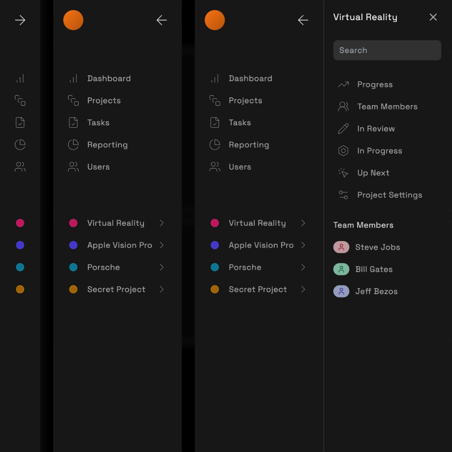

# 02 - Sidebar Navigation with Framer Motion and TailwindCSS



This project showcases a dynamic sidebar navigation menu built using NextJS, Framer Motion, and TailwindCSS. The sidebar provides smooth animations and an intuitive user experience, making it an excellent component for modern web applications.

## Installation

To run this project locally, follow these steps:

1. **Clone the repository:**

   ```bash
   git clone https://github.com/hyzkin/sidebar-navigation-nextjs.git
   cd sidebar-navigation-nextjs
   ```

2. **Install dependencies:**

   ```bash
   pnpm install
   ```

3. **Start the development server:**

   ```bash
   pnpm dev
   ```

4. Open your browser and navigate to `http://localhost:3000`.

## About

This project is built with NextJS, Framer Motion, and TailwindCSS to demonstrate how to create a modern, animated sidebar navigation. It highlights the power of combining these technologies to achieve a interactive user interface.

## More NextJS Projects

Check out my other NextJS projects [here](https://github.com/hyzkin/nextjs-typescript-projects).

## License

This project is licensed under the MIT License. See the [LICENSE](LICENSE) file for more details.

## Contact

For any questions or feedback, feel free to reach out to me at [hyzkin@outlook.com](mailto:hyzkin@outlook.com).
